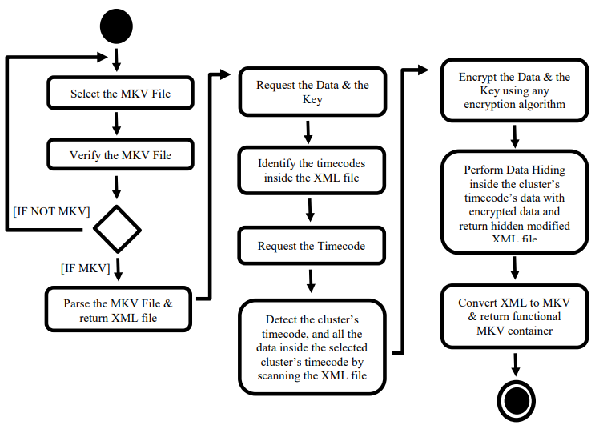
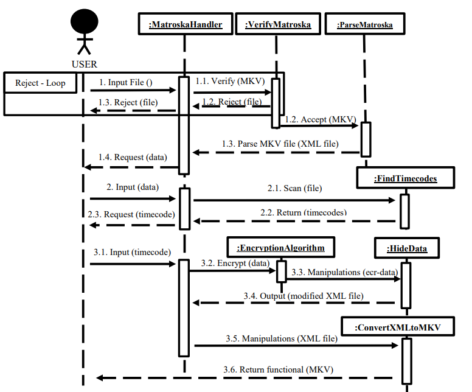
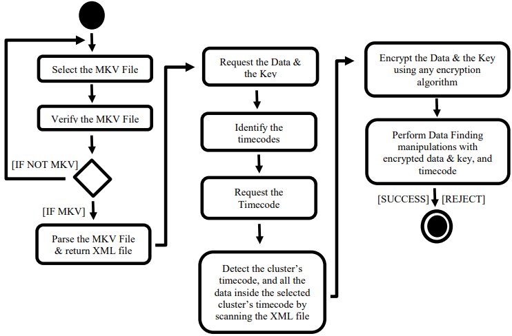
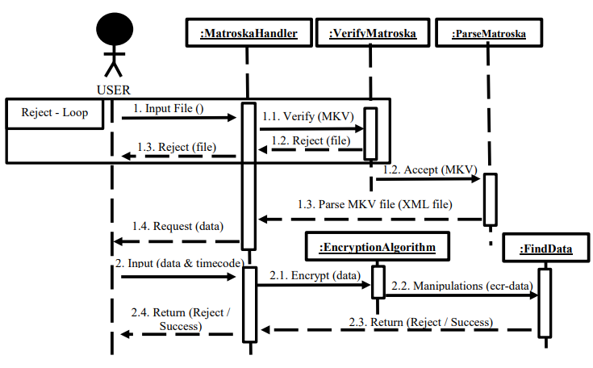

# 1.0 Data Hiding in MKV Container Format

# 1.1 Brief Description

The audio-video synchronization of MKV Container Format is exploited to achieve data hiding, where the hidden data can be utilized for various management purposes, including hyper-linking, annotation, and authentication

# 1.2 Video Demonstration @ YouTube

[Data Hiding (Hidden Watermark) in MKV Container Format](https://www.youtube.com/watch?v=mhZesLEC1ys&t=4s) 

# 1.3 Requirements

- Linux (not tested anywhere else)
- Python 
- .MKV reader (like VLC player)
- All the files are required:
  - .MKV video (./VideoForTesting/2mb.mkv)
  - ./convert_xml2mkv.py
  - ./parse_and_convert_mkv2xml.py
  - ./find_data.py
  - ./hide_data.py
  - ./find
  - ./hide
- Ensure that you have all the permission to access these files. Run the following command:
  ```chmod +x convert_xml2mkv.py && chmod +x find_data.py && chmod +x hide_data.py && chmod +x parse_and_convert_mkv2xml.py```
- If the command above doesn't work and Linux prevents your access you may use the following command on any of the affected files: ```chmod +x filename.extension```

# 1.4 How To Run Data Embedding Process

**Note: for screenshots refer to the end of the ```./Maxim_Zaika_Data_Hiding_in_MKV_Container.pdf``` file**

1. Ensure *1.3 Requirements* are fulfilled
2. Run ```./hide``` from your ```terminal``` within the folder where files are located.
3. Enter the name of the .MKV container: ```2mb.mkv```.
4. Enter the data that needs to be hidden: ```'example'```. **Write it down!**
5. Enter the SECRET KEY that will be used to decrypt your data in the data detecting process: ```'encryption key'```. **Write it down!**
6. Enter the timecode where data will be saved to: ```10.523``` or type ```'help'``` to display all the available timecodes. **Write it down!**
7. File ```modified_mkv.mkv``` should now be created that stores your hidden data.

**Note: do not lose ```text of the hidden data```, ```SECRET KEY```, and the ```timecode```. Otherwise, you won't be able to verify it later.** 

# 1.5 How To Run Data Detecting Process

1. Ensure *1.3 Requirements* are fulfilled
2. Run ```./find``` from your ```terminal``` within the folder where files are located.
3. Enter the file name: ```modified_mkv.mkv```.
4. Enter the text of your hidden data: ```'example'```.
5. Enter the SECRET KEY used: ```'encryption key'```.
6. Enter the timecode used: ```10.523```.
7. If the data is matching then it will show a success.

# 2.0 Data Embedding Process

## 2.1 Software Architecture of Data Embedding



## 2.2 Data Embedding Design



## 2.3 Data Embedding Pseudocode 

**Note: this is incomplete representation.**

```
Function main {
  Set a_word -> “word that needs to be written in”
  Set encryption_key -> “key used for the encryption”
  If (length of encryption_key) < (length of a_word) {
	  Set encryption_key -> same length as a_word
  }
  Set a_word -> convert to ascii
  Set encryption_key -> convert to ascii
  Set ascii_a_word -> convert to hexadecimal
  Set ascii_encryption_key -> convert to hexadecimal
  If (length of ascii_encryption_key) < (length of ascii_a_word) { 
	  Set ascii_encryption_key = -> same length as ascii_a_word
  }
  Encrypt a_word(ascii_a_word, ascii_encryption_key, a_word) // encrypt ascii word
                                                             // using original word 
  Convert encrypted word to hexadecimal // because MKV parser accepts hexadecimals
                                        // inside the cluster’s timecode
  Timecodes = [] // read the XML file and identify the timecodes
  Set input_timecode -> “input timecode here”
  Call function embed data (filename, input_timecode, encrypted_word_in_hexadecimal_format)
}

Function embed data {
	Loop through the file {
		Identify the location of the timecode {
			Identify the location of the data inside the cluster’s timecode {
				Write-in the data
			}
		} else not found timecode {
			Try again
		}
	}
}
```

# 3.0 Data Detecting Process

## 3.1 Software Architecture of Data Detecting


## 3.2 Data Detecting Design



## 3.3 Data Embedding Pseudocode 

**Note: this is incomplete representation.**

```
Function detect data {
	Set hexadecimal_word -> ‘the encrypted word’ \\ basically the identical process like in data 
						                                    \\ hiding process
	Loop through the file {
		Loop each line of the file {
			Identify the location of the timecode {
				Identify the data inside the cluster’s timecode {
					Read through the line ignoring first 6 characters // format
				}
				If there is at least 1 miss-match {
					Return error
				} else fully matched {
					Return success
				}
			}
		}
	}
}

```

# 4.0 Results

| Description      | Explanation |
| ----------- | ----------- |
| Limited Number of Cluster's Timecodes      | Modifying more than two cluster’s timecodes cause slight video distortion; however, modifying even more timecodes causes both video and audio distortions.       |
| Embedding Capacity   | Passed test of up to 2,500 characters. Assumption is that 2,500 characters should be more than enough for the user.        |
| File Size Increment | Original file: 2.1 MB (2,097,641 bytes) -> Modified File (2,500 characters): 2.1 MB (2,122,058 bytes). Increased by 23,417 bytes (1.00%). |

# 5.0 Additional Information

For more information (like testing and background information), refer to the .PDF file attached to this repository: ```./Maxim_Zaika_Data_Hiding_in_MKV_Container.pdf```

# 6.0 Credits

It would not be possible to complete this project without MKV > XML > MKV parser created by Vitaly "_Vi" Shukela: https://github.com/vi/mkvparse.

Parser is rewritten for my own needs (for better understanding) and included in this repository to ensure that there is no mismatch with Vitaly's version. If you are interested in the parser, please, refer to his repository provided above. I do not take any credit for its creation.